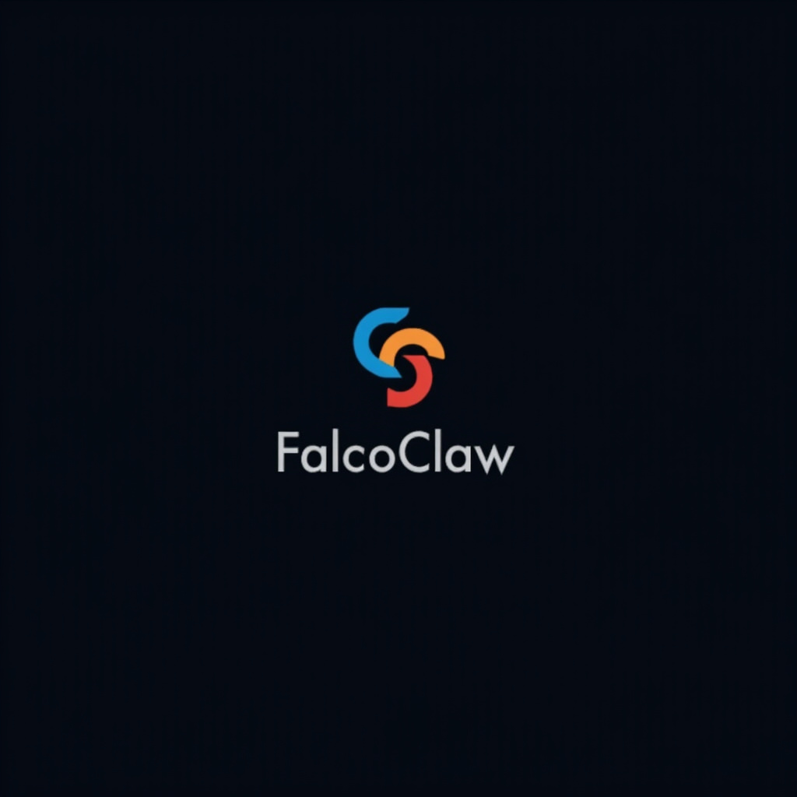

<p align="center">
  
</p>
<p align="center">
  <strong>Runtime security for AI agents and Linux workloads.</strong>
</p>
<p align="center">
  <a href="LICENSE"></a>
  <a href="https://go.dev"></a>
  <a href="https://github.com/thnkbig/falcoclaw/actions/workflows/ci.yml"></a>
</p>

FalcoClaw is an open-source runtime response engine built for [OpenClaw](https://github.com/openclaw/openclaw), [Hermes](https://github.com/NousResearch/hermes-agent), and any Linux system running AI agents. It extends [Falco](https://falco.org)'s syscall-level detection with automated response — killing malicious processes, blocking IPs, quarantining files, and dispatching investigations to your agents — all in milliseconds.

AI agent systems run with elevated privileges, install third-party skills, process untrusted input, and take autonomous actions. Traditional security tools weren't built for this. FalcoClaw is.

### Who is this for?

- **OpenClaw operators** — detect and respond to malicious skills, prompt injection, credential theft, privilege escalation, and unauthorized agent actions
- **Hermes Agent operators** — runtime security for self-improving agents with persistent shell access and skill execution
- **Linux sysadmins** — automated threat response for any bare metal server, VM, or non-Kubernetes container

### How it fits together

```
Falco (detection)  ──►  Falco Talon   (Kubernetes response)
                   ──►  FalcoClaw     (AI agents + Linux response)
```

## Why FalcoClaw?

Your agents can read files, execute commands, install packages, and make network connections. If one gets compromised — through a malicious skill, prompt injection, or a CVE — you need to detect it at the kernel level and respond before the agent can act on it.

FalcoClaw separates response into two layers:

**Automated response** — deterministic, no LLM in the loop. Kill the process. Block the IP. Quarantine the file. Milliseconds, not minutes.

**Intelligent investigation** — dispatch to your AI agents (OpenClaw or Hermes) for analysis. Let the agents do what they're good at — reasoning about context, correlating with history, recommending follow-up. But keep them out of the kill chain.

## How It Works

```
Kernel syscall
  → Falco detects anomaly (eBPF)
    → Falcosidekick routes alert
      → FalcoClaw matches response rule
        → Automated action (kill, block, quarantine)
        → Alert storage (PostgreSQL / file)
        → Agent dispatch (investigate, notify)
```

**Detection** — Falco observes runtime events at the kernel level via eBPF. FalcoClaw ships detection rules tuned for AI agent systems — unauthorized SMTP, cross-agent memory access, skill-spawned processes, credential theft patterns.

**Routing** — Falcosidekick distributes alerts to FalcoClaw and other downstream systems.

**Response** — FalcoClaw evaluates response rules and either takes bounded automated action or dispatches to an agent for investigation.

**Correlation** — Alerts stored in PostgreSQL enable enrichment, similarity matching, and historical context for agent-driven triage.

---

## Quick Start

### Build from source

```bash
git clone https://github.com/thnkbig/falcoclaw.git
cd falcoclaw
make build
```

### Install

```bash
sudo make install
# Binary → /usr/local/bin/falcoclaw
# Config → /etc/falcoclaw/config.yaml
# Rules  → /etc/falcoclaw/rules.yaml

# Optional: install as systemd service
sudo make service-install
```

### Docker

```bash
make docker
docker run -d --name falcoclaw \
  --privileged --net=host \
  -v /etc/falcoclaw:/etc/falcoclaw:ro \
  -v /var/quarantine:/var/quarantine \
  falcoclaw:latest
```

### Connect to Falco

Point Falcosidekick at FalcoClaw:

```yaml
# falcosidekick config
webhook:
  address: http://localhost:2804
  minimumpriority: warning
```

Or connect Falco directly:

```yaml
# falco.yaml
http_output:
  enabled: true
  url: http://localhost:2804
```

---

## Actionners

FalcoClaw uses **actionners** — pluggable response actions named with the pattern `category:action`. The same concept as Falco Talon, targeting Linux primitives and AI agent platforms instead of Kubernetes API calls.

### OpenClaw / Agent Platforms

| Actionner | Description | Safety Guard |
|---|---|---|
| `openclaw:disable_skill` | Disable a malicious or compromised OpenClaw skill | — |
| `openclaw:revoke_token` | Rotate gateway token after credential exposure | — |
| `openclaw:restart` | Restart OpenClaw gateway | — |
| `openclaw:disable_agent` | Disable a compromised agent | Protects main agent |
| `agent:notify` | Send alert to agent via webhook | — |
| `agent:investigate` | Dispatch to AI agent for analysis | — |
| `agent:telegram` | Send alert to Telegram chat/topic | — |

### Linux

| Actionner | Description | Safety Guard |
|---|---|---|
| `linux:kill` | Kill a process by PID | Protects PID 1 and self |
| `linux:block_ip` | Block IP via iptables with audit comment | Protects localhost |
| `linux:quarantine` | Move file to quarantine + immutable flag | — |
| `linux:disable_user` | Lock user account via `usermod -L` | Protects root |
| `linux:stop_service` | Stop systemd service | Protects sshd, dbus, systemd |
| `linux:firewall` | Apply custom iptables/nftables rule | — |
| `linux:script` | Execute response script with event context | Validates executable |

---

## Response Rules

Rules map Falco detection events to automated response actions:

```yaml
# Malicious OpenClaw skill detected stealing credentials
- name: Kill credential theft from skill
  match:
    rules:
      - "FalcoClaw — Skill Accessing Credentials After Install"
  actions:
    - actionner: linux:kill
      continue: true
    - actionner: openclaw:disable_skill
      parameters:
        skill: "suspicious-skill"
    - actionner: agent:investigate
      parameters:
        webhook_url: "http://localhost:3200/investigate"
        agent: responder

# Agent spawned a shell — possible prompt injection
- name: Investigate agent shell spawn
  match:
    rules:
      - "FalcoClaw — Shell Spawned by OpenClaw Agent"
  actions:
    - actionner: linux:kill
      continue: true
    - actionner: agent:investigate
      parameters:
        webhook_url: "http://localhost:3200/investigate"
        agent: responder
        question: "A shell was spawned by an agent. Investigate for prompt injection."

# Crypto miner on any Linux host
- name: Kill crypto miner
  match:
    rules:
      - "Detect crypto miners using the Stratum protocol"
  actions:
    - actionner: linux:kill
    - actionner: agent:notify
      parameters:
        webhook_url: "http://localhost:8080/alerts"
```

### Matching

- **rules** — list of Falco rule names (OR logic)
- **priority** — severity filter with operators (`>=Warning`, `Critical`, `<Error`)
- **tags** — tag groups with AND within group, OR across groups

### Action Flow

Actions execute sequentially. Set `continue: true` to proceed to the next action. Set `dry_run: true` at any level to log without executing.

---

## Response Model

### Automated Response

Bounded, deterministic actions — no LLM in the loop:

- Terminate a confirmed malicious process
- Block a malicious source IP
- Quarantine suspicious artifacts
- Disable an unsafe skill or plugin
- Rotate exposed credentials

### Escalated Response

Dispatched to AI agents or human operators for judgment:

- Investigate anomalous behavior patterns
- Correlate with historical alert data
- Recommend follow-up actions
- Escalate to human operators for high-impact decisions

---

## Relationship to Falco Talon

FalcoClaw is a complementary project to [Falco Talon](https://github.com/falcosecurity/falco-talon), not a replacement or fork. Falco Talon is the official response engine for Kubernetes environments. FalcoClaw extends the response engine concept to non-Kubernetes Linux workloads.

| | Falco Talon | FalcoClaw |
|---|---|---|
| **Target environment** | Kubernetes | Linux (bare metal, VMs, containers) |
| **Actionners** | `kubernetes:terminate`, `kubernetes:networkpolicy` | `linux:kill`, `linux:block_ip`, `linux:quarantine` |
| **Agent integration** | — | OpenClaw + Hermes plugins |
| **Response primitives** | Kubernetes API | Linux syscalls (kill, iptables, chattr, usermod) |
| **Language** | Go | Go |

If you run Kubernetes, use Falco Talon. If you run Linux without Kubernetes, use FalcoClaw. If you run both, use both.

---

## Design Goals

- **Runtime-first visibility** — respond to what processes actually do
- **Deterministic automated response** — no model inference in the kill chain
- **Agent-aware investigation** — dispatch to AI agents for analysis that benefits from reasoning
- **Human approval for high-impact decisions** — clear escalation boundaries
- **Auditable response chains** — every action logged with event context
- **Safety by default** — built-in guards prevent self-destructive actions

---

## Contributing

Contributions welcome. See [CONTRIBUTING.md](CONTRIBUTING.md).

```bash
git clone https://github.com/thnkbig/falcoclaw.git
cd falcoclaw
make build
make test
```

---

## License

[Apache 2.0](LICENSE)

---

## Acknowledgments

FalcoClaw builds on the excellent work of the [Falco](https://falco.org) community. The actionner pattern and rule format are inspired by [Falco Talon](https://github.com/falcosecurity/falco-talon).

FalcoClaw is an independent open-source project. It is not affiliated with, endorsed by, or sponsored by the Falco project, the Cloud Native Computing Foundation (CNCF), or The Linux Foundation. [Falco](https://falco.org) is a CNCF Graduated project. "Falco" and the Falco logo are trademarks of The Linux Foundation. All other trademarks are the property of their respective owners.

---

**Built by [THNKBIG Technologies](https://thnkbig.com)** — Give Engineers Their Time Back.

[falcoclaw.com](https://falcoclaw.com) · [@falcoclaw](https://x.com/falcoclaw)
